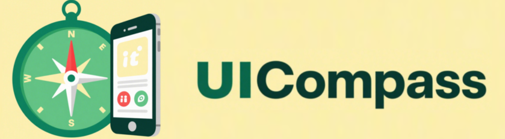

# UI Compass 🧭

 <!-- 替换为你的项目横幅或logo -->

This is the code repository for the paper  “UICOMPASS: UI Manual Guided Mobile Task Automation via Adaptive Instruction Replanning”

 <!-- 替换为你的项目横幅或logo -->

The repository mainly consists of three parts:  

1. **uimanualgenerator** → The code section for generating the UI manual.
2. **taskexecutor** → The part for task execution.  
3. **experiment** → Experimental results.

## 🛠️ UI Map Generator

## 🤖 Executor

## 📦 Run
1. Run the following command to generate the basic data.  
> python main.py
2. Run the following command to integrate it into the UI Manual.
> python UIManualGenerator.py

### ✨ Dataset
apk_list is the list of application APKs, and app_project is the list of application source code.

### Existing result.
The **program_analysis_results** contains the basic data we’ve already generated (Method-level analysis results). It includes class-level information and method-level information.

The code_maps folder contains the UI manuals for various applications.

