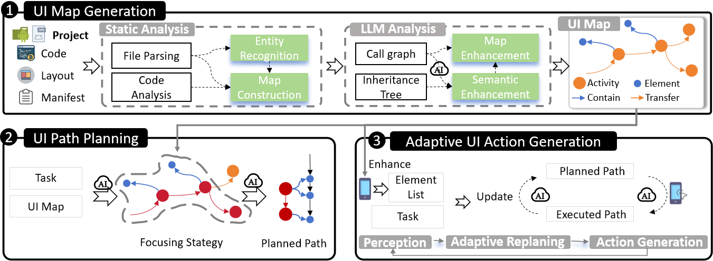

# UI Compass 🧭

 

This is the code repository for the paper  “UICOMPASS: UI Map Guided Mobile Task Automation via Adaptive Action Generation”


 <!-- overview -->

> Mobile task automation is an emerging technology that leverages AI to automatically execute routine tasks by users' commands on mobile devices like Android, thus enhancing efficiency and productivity. 
While large language models (LLMs) excel at general mobile tasks through training on massive datasets, they struggle with app-specific workflows. 
To solve this problem, we designed UI Map, a structured representation of target app's UI information.
We further propose a UI Map-guided LLM-based approach UICompass to automate mobile tasks.
Specifically, UICompass first leverages static analysis and LLMs to automatically build UI Map from either source codes of apps or byte codes (i.e., APK packages).
During task execution, UICompass mines the task-relevant information from UI Map to feed into the LLMs, generates a planned path, and adaptively adjusts the path based on the actual app state and action history.
Experimental results demonstrate that UICompass achieves a 15.87\% higher task executing success rate than SOTA approaches.
Even when only APK is available, UICompass maintains superior performance, demonstrating its applicability to closed-source apps.


The repository mainly consists of three parts:  

1. **uimanualgenerator** → The code section for generating the UI map.
2. **taskexecutor** → The part for task execution.  
3. **experiment** → Experimental results.


## 📥Install 

+ Set up the Android Emulator.
    +   Download Android Studi
    +   Create an Android Virtual Device (AVD).
+  Launch the Android Emulator.
+ [Optional] It's recommended to use conda.

```shell
 conda create -n android_world python=3.11.8
 conda activate android_world
```

+ Install UI Compass

```shell
git clone [this repo]
cd ./UICompass
pip install -r requirement.txt
```

+ Install Atx-agent
```shell
adb -s emulator-5556 push atx-agent /data/local/tmp/
adb -s emulator-5556 shell chmod 755 /data/local/tmp/atx-agent
# start atx-agent
adb  -s emulator-5554 shell  /data/local/tmp/atx-agent server -d
adb  -s emulator-5554    shell  /data/local/tmp/atx-agent server -d
```
If your Atx-agent is closed, you just need to run the command again.
```shell
adb  -s emulator-5554    shell  /data/local/tmp/atx-agent server -d
```

## 🛠️ UI Map Generator
1. Run the following command to generate the basic data.  
```shell
 python main.py
```
## 🤖 Executor
1. following command to integrate it into the UI Map.
```shell
> python UIManualGenerator.py
```


### ✨ Dataset
apk_list is the list of application APKs, and app_project is the list of application source code.


### Existing result.
The **program_analysis_results** contains the basic data we’ve already generated (Method-level analysis results). It includes class-level information and method-level information.

The code_maps folder contains the UI maps for various applications.


## 📝Citation
to be continue...


