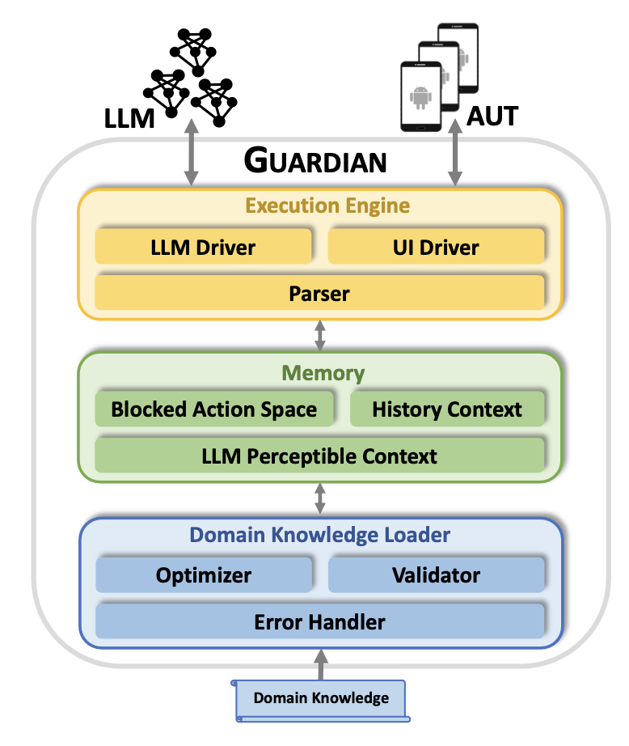

TaskExecutor is based on Guardian tools.

## NOTE
We are still testing the refactored version of Guardian, please try soon after our internal testing is done.

## Architecture of Guardian
The implementaion of Guardian strictly follows the overview presneted in our paper .


### Execution Engine


### Memory

### Domain Knowledge Loader

### Infrastructure 
We reuse part of our code originally used for developing [Badge](https://dl.acm.org/doi/abs/10.1109/ICSE48619.2023.00083), a tool for automated UI testing.


## Getting Started

These instructions will get you a copy of the project up and running on your local machine for development and testing purposes. See deployment for notes on how to deploy the project on a live system.

### Prerequisites

First create a virtual environment and install the [depedencies](requirements.txt)

```python
conda create -n guardian python=3.8.12 
pip install -r requirements.txt
```
Note that the dependencies of Guardian only requires the following packages:
- `uiautomator2==2.16.25` for the interactions with the App Under Test (AUT).
- `openai==0.27.2` and `tenacity==8.2.3` for robust ChatGPT API invocation.

We have tested Guardian with python 3.8.12.

### Setup Android Devices and App Under Test (AUT)

Please refer to [FestiVal Benchmark](https://github.com/PKU-ASE-RISE/FestiVal) proposed along with Guardian for Android device and AUT setup.


### Run Guardian for mobile UI navigation

```python
python run.py \
    --app_name Quizlet \
    --apk_name com.quizlet.quizletandroid \
    --testing_objective "turn on night mode" \
    --max_test_steps 30
```


